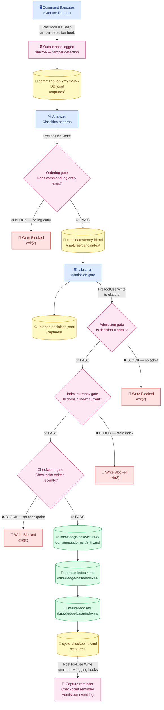
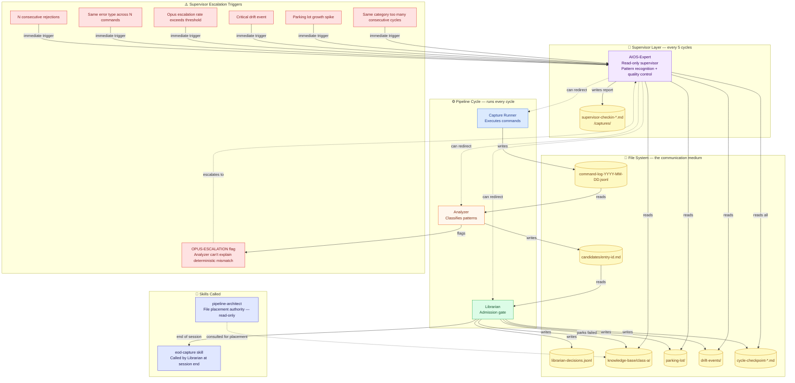
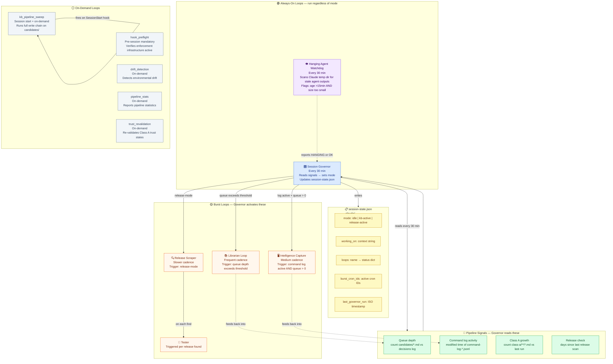

# AWACS Pipeline — Architecture Maps

> Four Mermaid diagrams that show exactly how the pipeline enforces itself.
> Data flow, agent roles, session loops, and the hook firing sequence.

Paste any diagram into [mermaid.live](https://mermaid.live) to view it rendered.
Start with Diagram 1 — it's the system's core contract. Everything else supports that path.

---

## Written Analysis

The AWACS pipeline is a **file-mediated, enforcement-gated knowledge system**. Agents never call each other directly — all communication flows through well-known file paths in `/captures/`. This makes the dependency graph a *data flow graph*, not a call graph: every connection is a file read or write, and every step is verifiable after the fact.

The hook layer is the integrity guarantee. Every write to the KB is blocked at the tool level unless all prior steps are verifiable in the file system. The agents are the actors; the hooks are the referees. The mandatory pre-flight check exists because if the hook runtime is missing, enforcement is silently bypassed — the hooks ARE the pipeline.

Session loops operate at two levels: always-on watchdogs that run every 30 minutes regardless of mode, and burst crons that the Governor activates dynamically when pipeline signals indicate activity. The Governor reads the file system to determine state — not in-memory signals — which means it can reconstruct an accurate picture at any time.

---

## Diagram 1 — The Write Chain with Hook Enforcement Points

The critical path from command execution to a Class A KB entry. Every arrow that crosses a gate has a hook blocking it at the tool level.

---

## Diagram 2 — Agent Roles, Interactions & Escalation Paths

Who reads and writes what, the supervisor check-in cadence, and the escalation triggers that break normal cycle flow.

---

## Diagram 3 — Session Loops: Cadence, Triggers & Pipeline Interaction

The always-on loops, burst loops, and how the Session Governor acts as the mode-switching controller. The Governor reads the file system to determine state — not in-memory signals.

---

## Diagram 4 — Hook Firing Sequence

Which hooks fire on which tool events, what they check, and whether they block or allow the operation. Hooks fire as Python subprocesses. Exit 2 = hard block. Exit 0 = allow. Exit 127 = Python not found = non-blocking (see pre-flight requirement).

```mermaid
flowchart LR
    classDef event fill:#dbeafe,stroke:#2563eb,color:#1e3a8a
    classDef hook fill:#fce7f3,stroke:#db2777,color:#831843
    classDef block fill:#fee2e2,stroke:#dc2626,color:#7f1d1d
    classDef pass fill:#dcfce7,stroke:#16a34a,color:#14532d
    classDef log fill:#fef9c3,stroke:#ca8a04,color:#713f12

    subgraph PRE_WRITE["PreToolUse — Write / Edit (fires BEFORE)"]
        direction TB
        EV1["✍️ Write or Edit\ntool called"]:::event
        H1["Environment write blocker\nBlocks .env file modifications"]:::hook
        H2["Build order: README gate\nBlocks code files without README"]:::hook
        H3["Build order: test-before-stack\nBlocks stack without tests"]:::hook
        H4["Build order: test-before-advance\nBlocks advancing without tests"]:::hook
        H5["Ordering gate\nBlocks candidate without command log entry"]:::hook
        H6["Index currency gate\nBlocks class-a if domain index is stale"]:::hook
        H7["Checkpoint gate\nBlocks class-a if no recent checkpoint"]:::hook
        H8["Admission gate\nBlocks class-a without librarian admit decision"]:::hook
        PASS1["✅ Write Allowed"]:::pass
        BLOCK1["🚫 exit(2) — Write Blocked"]:::block

        EV1 --> H1 --> H2 --> H3 --> H4 --> H5 --> H6 --> H7 --> H8
        H8 -->|"all pass"| PASS1
        H1 & H2 & H3 & H4 & H5 & H6 & H7 & H8 -->|"any fail"| BLOCK1
    end

    subgraph PRE_BASH["PreToolUse — Bash (fires BEFORE)"]
        direction TB
        EV2["💻 Bash tool called"]:::event
        H9["Git exfiltration blocker\nBlocks unauthorized git push/remote"]:::hook
        H10["⛔ Destructive command BRAKE\nBlocks dangerous infrastructure commands"]:::hook
        PASS2["✅ Bash Allowed"]:::pass
        BLOCK2["🚫 exit(2) — Command Blocked"]:::block

        EV2 --> H9 --> H10
        H10 -->|"safe"| PASS2
        H9 & H10 -->|"dangerous"| BLOCK2
    end

    subgraph POST_WRITE["PostToolUse — Write (fires AFTER)"]
        direction TB
        EV3["✅ Write completed"]:::event
        H11["Capture reminder\nReminds to log command captures"]:::log
        H12["Checkpoint reminder\nReminds to write cycle checkpoint"]:::log
        H13["Admission event logger\nLogs Class A admission events"]:::log

        EV3 --> H11 --> H12 --> H13
    end

    subgraph POST_BASH["PostToolUse — Bash (fires AFTER)"]
        direction TB
        EV4["✅ Bash completed"]:::event
        H14["Execution logger\nsha256 output hash — tamper detection"]:::log

        EV4 --> H14
    end

    subgraph SESSION_EVENTS["Session Lifecycle Events"]
        direction TB
        EV5["🚀 SessionStart"]:::event
        EV6["🗜️ PostCompact"]:::event
        H15["KB sweep\nScans candidates/ for unprocessed entries"]:::hook
        H16["Context reorientation\nReorients agent context after compaction"]:::hook

        EV5 --> H15
        EV6 --> H16
    end
```

---

## Key Observations

**1. The write chain is a one-way ratchet.**
Data only flows forward — command log → candidate → decision → class-a. There is no path to write class-a that bypasses any step. The hooks enforce this at the tool level, not by convention.

**2. The Governor is the only loop with write access to session state.**
All other loops are reactive. This creates a clean separation: the Governor is the brain, burst loops are the arms. The Governor can reconstruct accurate state from the file system alone — no in-memory dependency.

**3. Escalation is pull, not push.**
The AIOS-Expert doesn't receive notifications. It reads the file system on cadence and infers state from counts and timestamps. It can be run at any time and will produce an accurate picture from files alone.

**4. The Exit 127 problem is the single point of failure.**
Every hook depends on the Python runtime. If it's missing, exit 127 is non-blocking and the entire enforcement layer silently vanishes. The pre-flight check exists entirely to catch this before it happens. No pre-flight = no enforcement guarantee.

**5. The Hanging Agent Watchdog and Session Governor are the only always-on loops.**
Everything else is idle until the Governor activates it. In a quiet session, the only background activity is two processes checking signals every 30 minutes.

---

## Viewing Order

1. **Diagram 1** (Write Chain) — the system's core contract
2. **Diagram 4** (Hook Firing) — the same path from the enforcement angle
3. **Diagram 2** (Agent Roles) — the right diagram for onboarding someone new
4. **Diagram 3** (Session Loops) — zoom into the burst section to understand mode-switching

[← Back to write chain spec](write-chain.md) · [Trust tier rules →](trust-tier-rules.md)
