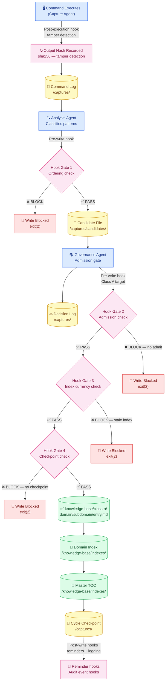
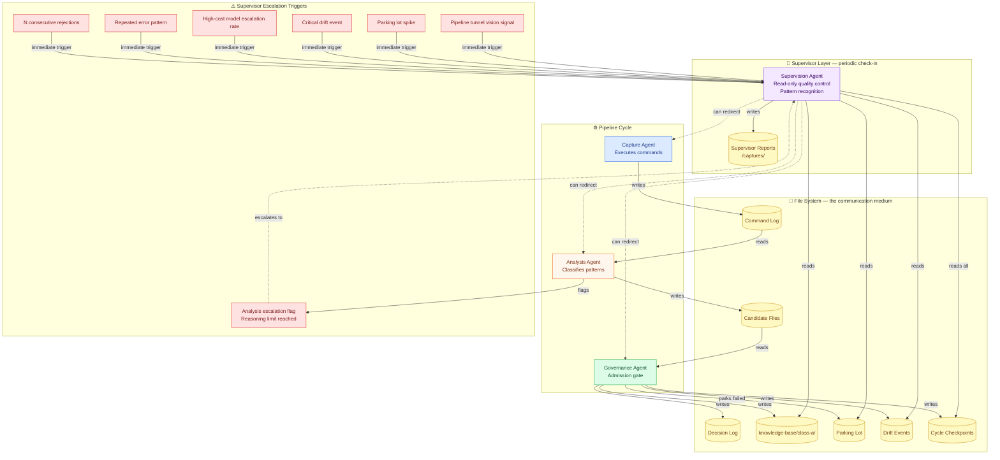
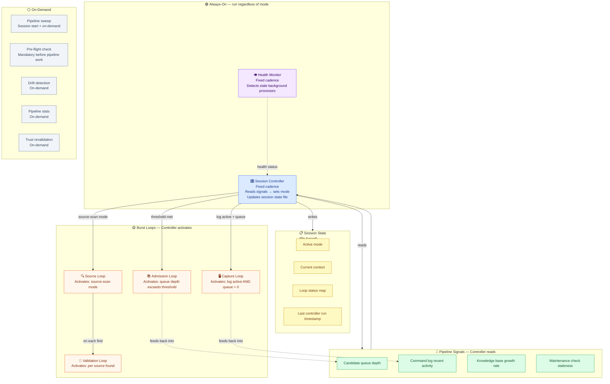
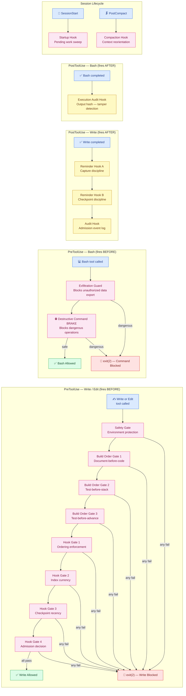

# AWACS Pipeline — Architecture Maps

> Four Mermaid diagrams showing how the pipeline enforces itself.
> Conceptual view — methodology only. Implementation details stay private.

Paste any diagram into [mermaid.live](https://mermaid.live) to view it rendered.
Start with Diagram 1 — it's the core contract. Everything else supports that path.

---

## Written Analysis

The AWACS pipeline is a **file-mediated, enforcement-gated knowledge system**. Agents never call each other directly — all communication flows through well-known file paths. This makes the dependency graph a *data flow graph*, not a call graph: every connection is a file read or write, and every step is verifiable after the fact.

The hook layer is the integrity guarantee. Every write to the knowledge base is blocked at the tool level unless all prior steps are verifiable in the file system. The agents are the actors; the hooks are the referees.

Session loops operate at two levels: always-on monitors that run on a fixed cadence regardless of mode, and burst loops that activate dynamically when pipeline signals indicate activity.

---

## Diagram 1 — The Write Chain with Enforcement Gates

The critical path from command execution to a Class A knowledge base entry. Every arrow that crosses a gate has a hook blocking it at the tool level.

---

## Diagram 2 — Agent Roles & Escalation Paths

Who reads and writes what, the supervisor cadence, and the escalation triggers that break normal cycle flow.

---

## Diagram 3 — Session Loops: Cadence & Activation

Always-on monitors and signal-activated burst loops. The Session Controller reads the file system to determine state — not in-memory signals.

---

## Diagram 4 — Hook Firing Sequence

Which hook categories fire on which tool events, and whether they block or allow the operation. Exit 2 = hard block. Exit 0 = allow. Exit 127 = runtime missing = non-blocking (see pre-flight requirement).

---

## Key Observations

**1. The write chain is a one-way ratchet.**
Data only flows forward. There is no path to write Class A that bypasses any gate. The hooks enforce this at the tool level, not by convention.

**2. The Session Controller is the only component with write access to session state.**
All other loops are reactive. The Controller is the brain; burst loops are the arms.

**3. Escalation is pull, not push.**
The Supervision Agent reads the file system on cadence and infers state from counts and timestamps. It can be run at any time and will produce an accurate picture from files alone.

**4. The Exit 127 problem is the single point of failure.**
Every hook depends on the Python runtime. If it's missing, exit 127 is non-blocking and the entire enforcement layer silently vanishes. The pre-flight check exists entirely to catch this before it happens.

**5. In a quiet session, only two processes run.**
The Health Monitor and Session Controller run every 30 minutes. Everything else is idle until signals activate it.

---

[← Write chain spec](write-chain.md) · [Trust tier rules →](trust-tier-rules.md)
